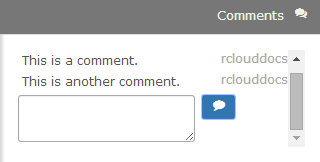
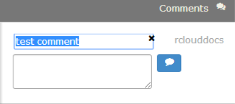
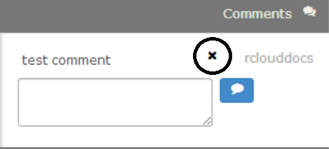

# Comments

Anyone can leave comments about anyone's notebooks in the Comments panel in the right sidebar, as demonstrated below:

Comments are included in search results.

To submit a comment, simply input your text in the text area and click the comment icon . You can also submit your comment by pressing Ctrl-Enter (Win/Linux) or Cmd-Enter (Mac).

## Editing Comments

To edit a comment, click on the comment text to make changes. Then click Ctrl- or Cmd-Enter to update the comment.

## Deleting Comments

To delete a comment, hover your mouse over the comment. Click the X next to the comment to delete it.

