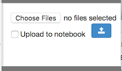
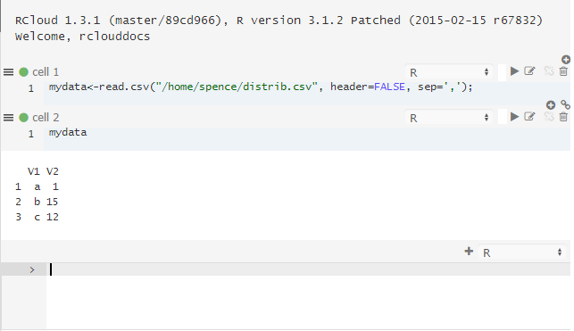

# Data Access

## File Upload

There many ways to use your own data in RCloud. Please see the example notebooks under RCloud Sample Notebooks for some examples. Here, we'll take a closer look at the simplest method: uploading a flat file. Open the File Upload panel on the right sidebar by clicking on the heading.  Then, select "Choose File" and browse to a local file, in this case "distrib.csv."

Next, click the "Upload" button. If the file exists (just where, we'll get to in a moment), RCloud prompts with a notice that it will be overwritten. If all goes well, RCloud confirms the upload.

The file now exists in your installation server's home directory and is accessible from within RCloud. For example:

The first line of R code loads the contents of the CSV file into an object called "mydata." The next line tells R to output a string version of the object.

## Upload to Notebook

The **Upload to Notebook** checkbox changes the way File Upload works.  Rather than uploading your file to your home directory, RCloud will store the file inside your notebook as an "asset." To view notebook assets, click on the assets bar on the right sidebar. Please see the [Notebook Assets](#notebookassets) section for more information.

