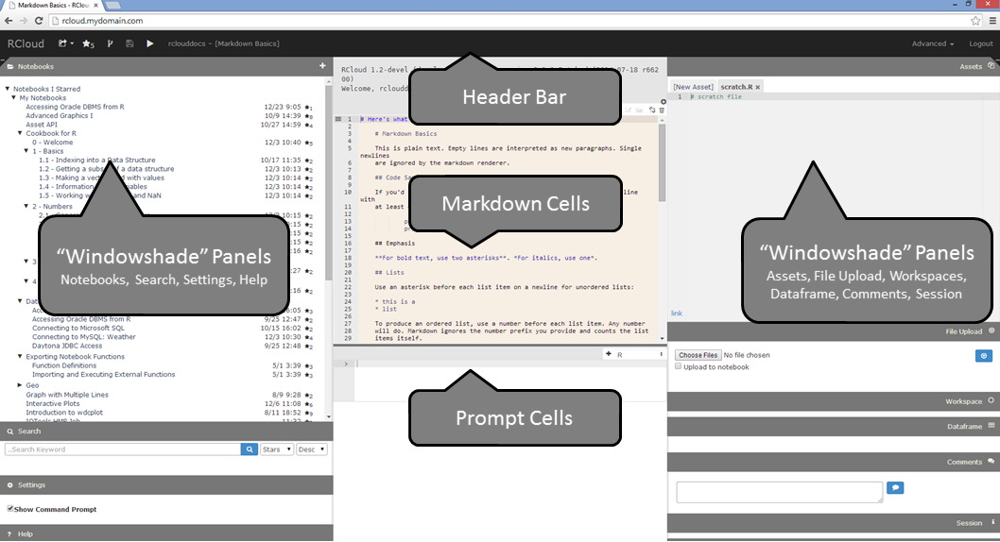
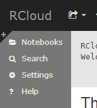
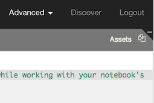

# Graphic User Interface (GUI) Overview

## Parts of the GUI

The RCloud GUI consists of: \* Header Bar located in the banner or navigation section of the browser \* Left and right Windowshade Panels \* Prompt and Markdown Cells located in the center of the screen

[Top](#TOP)

## GUI Navigation

### Opening and Closing Panels

Clicking on the title of a panel opens and closes (and resizes in some cases) RCloud panels, such as Notebooks and Search.

[Top](#TOP)

### Opening and Closing All Panels

When all RCloud panels are minimized in a column, a "+" sign will appear, as shown here.

Clicking the "+" sign will restore all panels in the column to their previous sizes. Now, a "-" sign will appear, shown below, which will minimize all open panels in a column.

[Top](#TOP)

### Changing Panel Width

To change the width of a panel, hover your mouse over the the edge that touches the cells in the middle. When it changes into a double arrow, click and drag left and right to resize.

[Top](#TOP)

