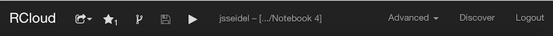
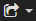
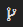
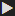
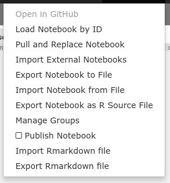
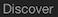
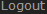

Header Bar
==========

The RCloud header bar is located at the top of the browser and contains
several notebook control icons:

: Please see the [Sharing
Your Notebooks](#sharingyournotebooks) section for more information.

: Click the star icon to
toggle the appearance of the current notebook in the "Notebooks I
Starred" area on the left sidebar. The icon displays the number of
RCloud users who have added the notebook to their interests. In the case
shown above, five users have done so.

: Click the fork icon to
make a new copy of a notebook for editing.

: Whenever you run a
notebook, RCloud automatically saves a revision in GitHub. If you need
to close your RCloud session immediately without waiting for a lengthy
run time, click the save icon to save a revision immediately.

: Click the play icon to
run all [Markdown and Prompt cells](#cells) in the current notebook.
Cells are executed asynchronously. RCloud displays the output as it
becomes available.

 : This is the title of the current notebook.
In this case, "Markdown Basics." Click the title to change it.

Note that you can create sub-directories simply by adding any number of
forward slashes '/', like on a Unix command line. E.g. Cookbook for R/1
- Basics/1.1 - Indexing into a Data Structure. If the sub-directories
don't already exist, RCloud will create them on the fly, so there is no
need to create individual sub-directories before changing the name of
your notebook. Sub-directories allow you to group your notebooks and
will be displayed in a tree-like hierarchy in the [Notebooks
section](#notebooks) of the left sidebar.

Also, if the notebook was created as a result of [Forking another
notebook](#forkingcopyinganotebook), the forked notebook name is
displayed in a smaller font beneath the current notebook's title.

Click the Advanced drop-down menu to access more features:

-   **Open in GitHub**: Notebooks are stored as "gists" using the
    [RCloud Gist Service](https://github.com/att/rcloud-gist-services).
    This means you get all the power of a source-control versioning
    system for free. Behind the scenes, RCloud stores every revision of
    your notebooks, so you can retrieve them later, if necessary.
-   **Load Notebook by ID**: Replace the current notebook with another
    via URL or GitHub Gist ID.
-   **Pull and Replace Notebook**: Opens a dialog box where you can tell
    RCloud to copy the contents of an existing notebook in the same
    RCloud instance via URL, file, or ID and replace the contents of the
    current notebook.
-   **Import External Notebooks**: Using this dialog, you can import
    multiple notebooks stored in another GitHub repository. You'll need
    the source GitHub repository API URL and a list of notebook IDs,
    newline separated. In addition, you can supply a prefix that will
    cause all the imported notebooks to go into a folder. E.g.
    "myfolder/". Note the trailing '/' character.
-   **Export Notebook to File**: Your browser will automatically save a
    copy of the current notebook in JSON format in whatever directory
    you've designated for downloads. The file name will be the same as
    your notebook with a .gist extension.
-   **Import Notebook from File**: In order to import a notebook, it
    must be in the same format as an exported notebook. Once you specify
    the notebook's location, you can validate the notebook by clicking
    the word "Validate." To import, click the Import button.
-   **Export Notebook as R Source File**: When selected, your browser
    will download an R source text file named after your notebook with
    .R appended.
-   **Manage Groups**: Opens the Notebook Permissions / Group Management
    dialog, where you can [manage your
    groups](#protectingyournotebooks).
-   **Publish Notebook**: By default, users who wish to view your
    notebooks must be logged into RCloud. If the Publish Notebook box is
    checked, *any* user who has network access to the notebook's URL
    will be able to view the notebook. Obviously, editing features will
    be turned off for these users.
-   **Import Rmarkdown File**: Imports Rmarkdown containined in a .Rmd
    file.
-   **Export Rmarkdown File**: When selected, your browser will download
    an Rmarkdown text file named after your notebook with .Rmd appended.

: Click the
Discover link in the header bar to view the most recent and most popular
notebooks.

You can create a mini-view of your notebook for this Discover view by
creating an asset called `thumb.png`. `thumb.png` will be displayed in
the Discover view if present.

: Click Logout to end your
RCloud session.

[Top](#TOP)

