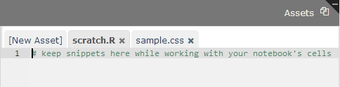
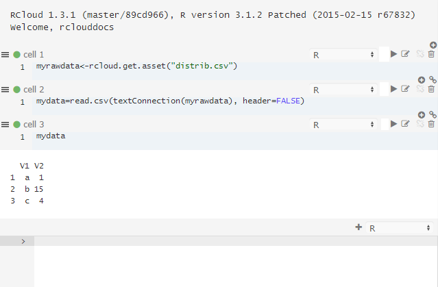
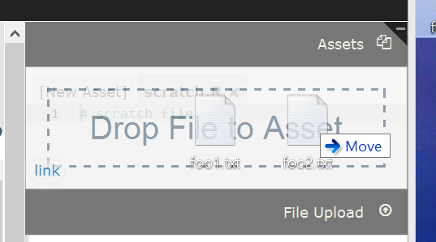
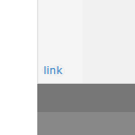
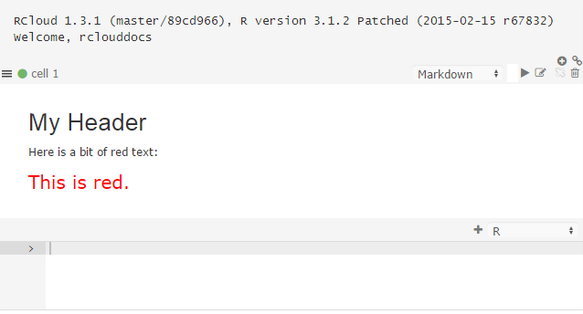
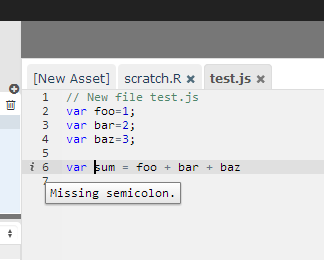
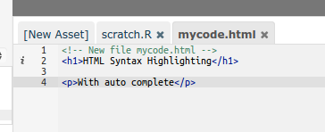
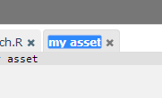

# Notebook Assets

Notebooks can contain "assets," which are files that can be used within your notebooks or simply for keeping track of unused code (as in the the case of scratch.R, which is a text file where you can keep bits of code while working on your notebook).

[Top](#TOP)

## Data as an Asset

For example, from the previous example, lets create an asset called distrib.csv that contains the following data:

        a,1
        b,15
        c,4

We can store this data in a new asset called "distrib.csv," simply by clicking New Asset and typing distrib.csv as a name.

Now, this data is accessible in your R code:

[Top](#TOP)

## Uploading Assets

In addition to manually entering asset text, you can also drag and drop files into the Assets panel to upload them:

[Top](#TOP)

## Assets Links

RCloud automatically generates asset links and displays them in the lower left-hand corner of the Assets panel. To copy the URL, right-click on it.

[Top](#TOP)

## Binary Assets

Assets can be binary (e.g. an image). RCloud auto-detects the content format and transparently encodes and decodes using base-64 encoding.  When possible, the content is displayed in its native format in the asset panel.

[Top](#TOP)

## Asset Size

Assets are limited to 2.5MB each.

[Top](#TOP)

## Cascading Style Sheets (CSS)

Assets can contain Cascading Style Sheet (CSS) formatting information.  This changes the way information is presented when your notebook is executed. For example, here is a bit of CSS that defines a paragraph style:

    p.mystyle {
        font-size: 20px;
        color: red;
    }

To use this CSS as an asset, it needs to have a special name that begins with "rcloud-" and ends with ".css". In the example below, the name is "rcloud-mystyle.css".

RCloud automatically uses CSS asset files with this file pattern and ignores others, so you can save bits of CSS in other files without worrying about overlap.

To use the p.mystyle paragraph style, simply reference it in Markdown using HTML:

    # My Header

    Here is a bit of red text:

    
This is red.

Note that you must reload your notebook to apply the CSS.

[Top](#TOP)

## JavaScript

Assets can also contain JavaScript. When editing JavaScript (files must have the .js extension), RCloud automatically uses a JavaScript editing mode, which has built-in syntax checking.

[Top](#TOP)

## HTML Mode

When editing HTML (files must have the .html or .htm extension), RCloud automatically uses an HTML editing mode, which has built-in syntax checking and tag completion.

[Top](#TOP)

## Renaming Assets

To rename an asset, simply click on the file name on the asset's tab.

[Top](#TOP)

