Notebooks
=========

RCloud notebooks are simply collections of prompt and Markdown cells,
comments, and assets, which we'll get to later. Everything in your
public notebooks is searchable by every other user of the system. This
encourages reuse and makes learning how to use the hundreds of available
R packages easier.

You can also browse everyone else's notebooks by opening the Notebooks
section on the left sidebar. To do this, simply click on Notebooks at
the top of the panel. This toggles the panel, opening or closing it:

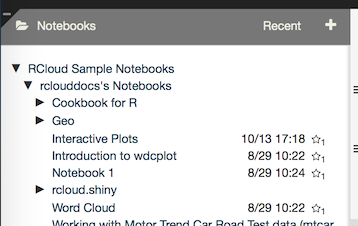

To load a notebook into the current session, click on the name. After it
loads, you can examine the source code or click "Run" in the header bar
to execute all the cells on the page.

[Top](#TOP)

Creating a Notebook
-------------------

To create a new, blank notebook, click the + sign at the right of the
Notebooks panel header area:

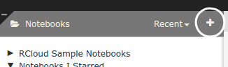

RCloud will automatically choose a title for your new notebook, Notebook
N, where N is the next available number among your notebooks. To give
your notebook a more meaningful title, click on the [title in the header
bar](#notebooktitle).

To change the default name of new notebooks, see the [New Notebook
Prefixes](#newnotebookprefixes) sub-section in the Settings panel.

[Top](#TOP)

Running a Notebook
------------------

To run all the cells in your notebook, click the  icon in the header bar.

RCloud notebooks are executed asynchronously. RCloud will show
individual cell results as the results are ready to display.

To run only selected cells, hold down the `Ctrl/Cmd` key when you lick
the  icon in the header
bar. See the [Multi-Cell Selection](#multi-cell-selection) section for
more information about multiple-cell selection.

### Partial Notebook Runs

Pressing the  icon in a
cell while holding down the `shift` key will run that cell and every
cell after in order.

[Top](#TOP)

Long-Running Notebooks
----------------------

Notebooks that run longer than a few seconds will cause the browser
screen to dim and a please-wait message to be displayed.

Currently, RCloud has no explicit mechanism to stop a long-running
notebook. If you mistakenly launch a long-running notebook, you can
simply reload the notebook in another browser tab or reload the page.
This doesn't stop the execution behind the scenes, but the output of the
previous run will not interrupt your current session. Be careful of
side-effects, like changing the contents of a file in your local
directory in such a way that it affects the output of the notebook.

[Top](#TOP)

Forking (Copying) a Notebook
----------------------------

To copy another user's notebook, first navigate to it in the left
sidebar and then click to load it into your current session. Now, you're
running another user's public notebook in your own session. This is
sufficient for running reports or performing other read-only activities.
If you want to edit the notebook, you'll need to make your own copy, or,
"fork" it.

After you've loaded the notebook you want to fork, click the Fork icon
in the header bar at the top of the screen:

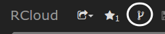

After forking a notebook, you'll own your own copy and therefore be able
to edit it.

The fork icon is always available, which means you can fork your own
notebooks. If you are viewing a previous version of a notebook, you can
fork a copy of that version. Caution: currently when you fork your own
notebook, the history is lost; we hope to fix this soon.

[Top](#TOP)

Saving Your Work
----------------

There are two mechanisms by which your work is saved in RCloud.

[Top](#TOP)

### Manual Saving

You can save your notebook at any time by clicking the  icon in the header bar.

[Top](#TOP)

### Versioning

RCloud keeps track of your notebook versions automatically and
frequently. Every time you save, create, or run a Markdown or Prompt
cell, the newest version of your notebook is saved. To browse the
versions of your notebook, which are stored chronologically with the
latest version on top, hover over the name of your notebook in the left
sidebar and click the clock icon. A drop-down list of versions will
appear:

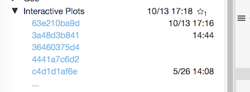

To change they way dates and times are displayed next to your notebook
versions, see the [show terse version dates](#showterseversiondates)
setting.

[Top](#TOP)

<a name="versiontagging" />

#### Version Tagging

To "tag" a notebook version, click twice on a version name to edit it in
place.

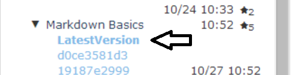

Now, rather than referring to a specific notebook version with
<code>&version=hash</code> in a URL, you can refer to a specific
notebook tag:

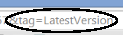

<code>&tag=name</code>

This is useful when you want to share a version of a notebook but plan
to continue developing it. For example, you can tag a version as the
"LatestProductionVersion," and then apply that tag to another version
when you're ready to share your new work. This way, existing URLs
(perhaps stored in someone's bookmarks) won't break as you update your
notebooks.

[Top](#TOP)

#### Reverting to a Previous Version

Should you decide that a previous version of your notebook is the "best"
version, you can make that version the current version by loading the
desired previous version of the notebook and clicking the revert icon.

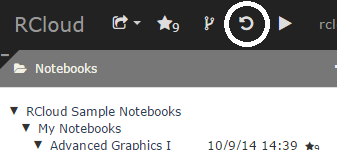

[Top](#TOP)

Hidden Notebooks
----------------

By default, all RCloud notebooks are visible to all RCloud users. If
you'd like to toggle the Show/Hide flag on a notebook, hover over the
name of your notebook on the left sidebar and click the eye icon. Note
that hidden notebook titles are grayed out for owners and invisible to
other users.

Hidden notebooks are only invisible within the RCloud interface. Hidden
notebooks are still visible within the gists stored in your GitHub
instance.

[Top](#TOP)

### Toggle Hidden

Clicking the 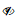
icon will hide your notebook from other RCloud users.

[Top](#TOP)

### Toggle Show

Clicking the  icon
will make your notebook readable by other RCloud users.

[Top](#TOP)

Protecting Your Notebooks
-------------------------

Protected notebooks are readable only by the owner and (optionally) a
select group of users and will not show up in search results (although
previously unprotected versions might).

### Notebook Permissions

View or modify notebook protection by clicking the notebook "info"
button next to the notebook name in the notebooks tree:

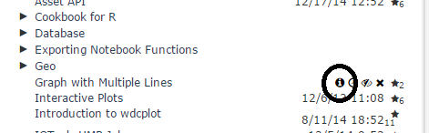

If you own the notebook, click the "public" link (or "no group" if that
displays):

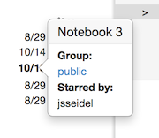

This opens the notebook protection dialog:

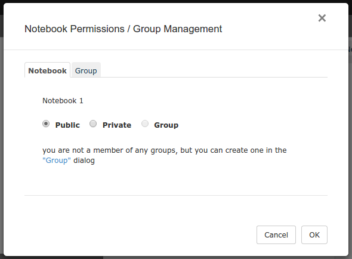

Here, you can assign the notebook to any group you are a member of, make
it entirely private (readable only by you), or make it public (readable
by anyone).

### Groups

Use the second tab of the protection dialog to create/rename groups
and/or assign other users as administrators/members of groups you
administrate. Alternatively, you can select Manage Groups from the
Advanced menu item on [the header bar](#theheaderbar) — note that the
Notebook tab will be grayed out in that case, as Manage Groups is not
notebook specific.

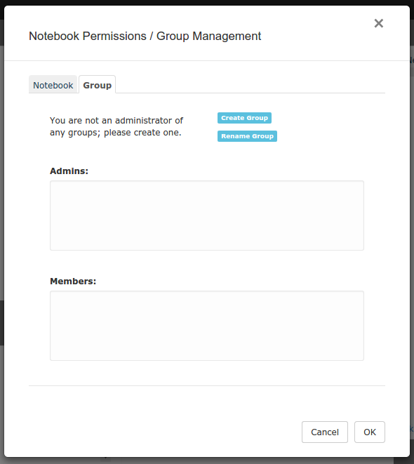

Unlike a hidden notebook, protected notebooks are not readable by anyone
without permission, even within your GitHub instance.

[Top](#TOP)

Deleting Notebooks
------------------

To delete a notebook, hover over the name of your notebook in the left
sidebar and click the 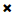
icon.

RCloud will ask for a confirmation:

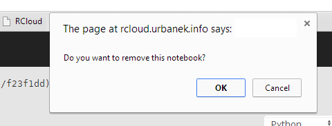

Click OK and the notebook will disappear from the left sidebar and the
last-viewed available notebook will automatically load into the current
session.

[Top](#TOP)

Sharing Your Notebooks
----------------------

There are several ways you can share/view your notebooks with
colleagues. When you click on the downward arrow next to the share icon
in the header bar , a
popup menu will appear:

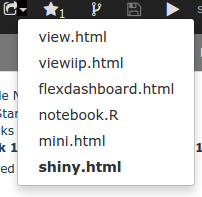

This allows you to select the kind of URL you'd like to share. Make your
selection using the popup menu and then right click on the  icon to copy the hyperlink.

Clicking on a selection in the sharing menu will open a new browser tab
and load the selected link.

Note that if you have a tagged version of your notebook currently
loaded, where appropriate, RCloud will populate the shared URL with the
tag instead of the version. This is beneficial because then you can tag
future versions with the same tag and not break existing URLs.

[Top](#TOP)

### view.html

This is the simplest method. This will create a link that will allow
someone to see the notebook code and execute the notebook within the
RCloud IDE. Users who do not own the notebook will see the play  and share  icons in the header. Clicking the play icon
will execute all cells in the notebook. Clicking the edit icon will
return to the normal header, allowing a user to fork the notebook, etc.

#### Hiding UI Elements

To hide *all* UI elements, add `&quiet=1` to the URL. Note that this
works only with view.html.

[Top](#TOP)

### viewiip.html

View the notebook as a Slidy Powerpoint-like slideshow.

[Top](#TOP)

### flexdashboard.html

View a notebook that uses the flexdashboard package.

[Top](#TOP)

### notebook.R

This option is intended for [FastRweb](http://rforge.net/FastRWeb/)
notebooks. Loading the URL (from anywhere, including other notebooks, a
perl script, etc.) executes a notebook "behind the scenes" by opening a
one-time R session, running the defined "function" within, shutting down
the R session, and finally, returning the result. FastRweb notebooks
MUST have a function named `function()` defined, as this what notebook.R
tries to execute upon instantiation. Output from notebook.R can be
anything. Text, binary data, whatever, as this information will
ultimately be processed by whatever mechanism that called notebook.R.

notebook.R allows trailing paths to be processed by the notebook code if
they start with /.self/. The subsequent path portion is passed to the
run function as the .path.info argument. This allows notebooks to handle
a "full tree" argument to the notebook on top of a single notebook URL.

E.g.: https://rcloud.mydomain.com/notebook.R/user/notebook/.self/foo/bar
will call the notebook with .path.info set to /foo/bar. Note that the
.self part distinguishes asset look up from a path info call.

See the [notebook.R URLs](#notebookrurls) section of the documentation
for more detailed information about notebook.R URLs.

[Top](#TOP)

### mini.html

Unlike notebook.R, mini.html URLs open an R session via a Websocket and
keep it open. Mini.html notebooks MUST have a function named
`rcw.result()` defined, as that is what mini.html tries to execute upon
instantiation. Because the R session is kept open, users or processes
can interact with the R session while the websocket is kept open.

[Top](#TOP)

### shiny.html

RCloud supports the [RStudio Shiny web application
framework](#http://shiny.rstudio.com/). To share [Shiny-enabled
notebooks](#rstudioshinysupport), select this option.

[Top](#TOP)

Who Starred my Notebook?
------------------------

To find out which users starred your notebook, click the notebook
information icon:

[Top](#TOP)

Multi-Cell Selection
--------------------

You can use RCloud's multi-cell selection features to perform various
actions on many cells at once.

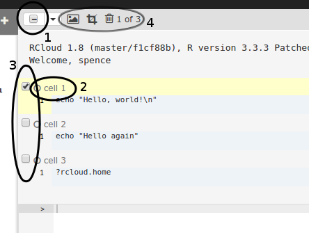

1.  At the top of your loaded notebook, you'll find a header bar. Click
    the checkbox to select/deselect every cell in your notebook.
2.  Click a cell's header to select that cell. Note that clicking the
    header of a selected cell **does not** deselect the cell.
3.  Click a cell's checkbox to select/deselect that cell.
4.  Click the  icon to hide the
    output of selected cells. Note that this feature is only available
    with your own notebooks. Click the 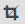
    icon to remove every cell that **isn't selected**. Click the
    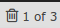 icon to delete all **selected
    cells**. Note that RCloud will indicate how many cells are selected
    out of the total number of cells.

Use the checkbox dropdown menu to fine-tune your selection:

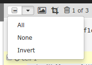

-   **All** selects every cell in your notebook.
-   **None** un-selects every cell in your notebook.
-   **Invert** changes every selected cell to an unselected cell and
    every unselected cell to a selected cell.

Multi-cell selection supports common keyboard extensions:

1.  **Shift-clicking** a cell's checkbox will select all cells between
    the last selected checkbox and the current checkbox.
2.  **Ctrl/command-clicking** a cell's checkbox is functionaly
    equivalent to simply checking a cell's checkbox and is noted because
    this is a common selection activity.
3.  Pressing the **delete key** will delete all selected cells.
4.  **Ctrl/command-k** will crop (remove) all unselected cells.
5.  **Ctrl/command-Shift-i** will invert the selection (check all
    unchecked cells and uncheck all checked cells).

[Top](#TOP)

Find and Find Replace
---------------------

To find text within your notebook, type Ctrl-F (Win/Linux) or Cmd-F
(Mac) to open a find dialog at the top of your notebook:

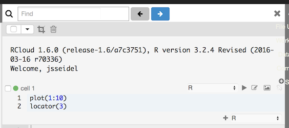

To find and replace text within your notebook, type Ctrl-H (Win/Linux)
or Cmd-Option-F (Mac) to open a find and replace dialog at the top of
your notebook:

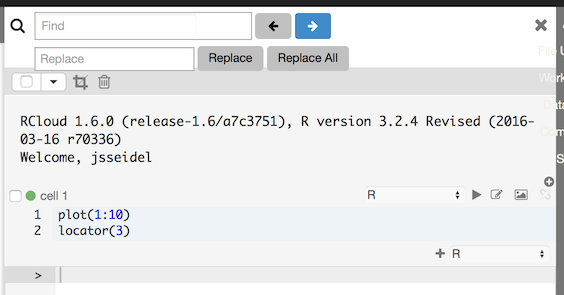

[Top](#TOP)

Recent Notebooks
----------------

Access your recently opened notebooks via the Recent link in the
Notebooks titlebar:

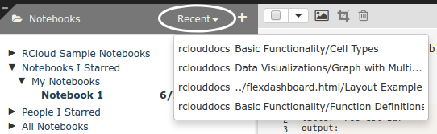

[Top](#top)

