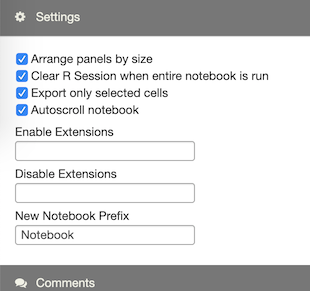

# Settings

Various aspects of your RCloud environment parameters may be changed in the Settings section of the left Windowshade panel, including the default new notebook name.

## Show command prompt

This setting toggles the appearance of the default prompt cell that appears at the bottom of the currently loaded notebook.

## Show terse version dates

This controls how RCloud displays dates when viewing notebook versions.  When selected, RCloud will display dates and times only when they're different from the version before it.

## Show cell numbers

Toggles "Cell 1," "Cell 2," etc. in the cells panel.

## Arrange panels by size

In some situations, larger panels on the left-hand side of the GUI "crowd-out" the currently loaded notebook and force the user to resize.  In order to minimize this, select the "Arrange Panel by Size" checkbox in the Settings panel. RCloud will then rearrange panels in order to reduce the need for resizing the notebook. 

## Clear R Session when entire notebook is run

Runs notebooks as though you'd just logged in.

## Export only selected cells

In the various export commands available in the Advanced header menu item, only export selected cells.

## Extensions

Power users can extend RCloud's user interface with global and per-user extensions. Although this functionality is outside the scope of this document, more information is available [here](https://github.com/att/rcloud/wiki/RCloud-UI-Extensions).

You can enable and disable extensions using the "Enable Extensions" and "Disable Extensions" text boxes. These set the user options `addons` and `skip-addons`, respectively. On starting the session, any extensions listed in `skip-addons` are not loaded.

Enter a list of extensions, comma delimited, and press enter. You will then have to reload the page.

## New notebook prefixes

Use the New Notebook Prefix setting to change how RCloud names [new notebooks](notebooks.html#creating-a-notebook).

Suppose you were working on a project, Foo. You might choose "Foo " for your new notebook prefix. New notebooks would be named "Foo 1," "Foo 2," and so on.

You can also include a folder. RCloud then places new notebooks within that folder in the notebook tree. For example, you may choose to make "Foo/Notebook " your new notebook prefix name. RCloud would create new notebooks "Foo/Notebook 1," "Foo/Notebook 2," and so on.

